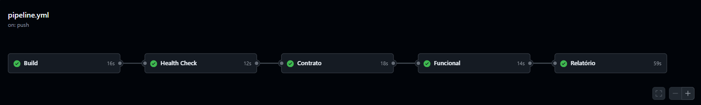
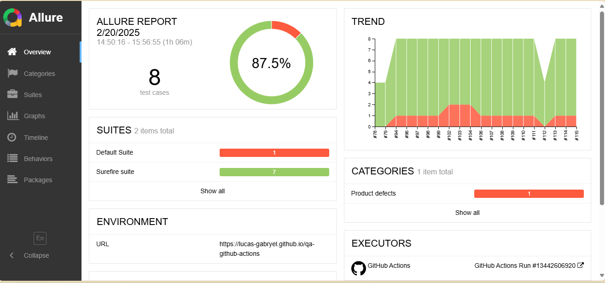
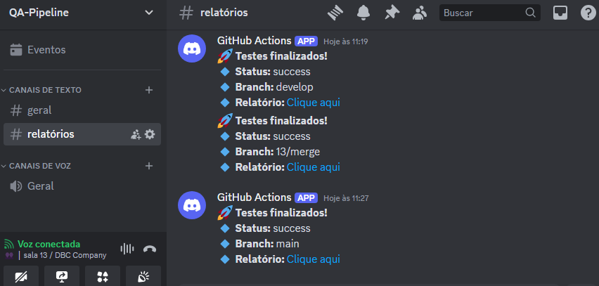

# Pipeline de CI/CD

## Descrição

Este repositório contém testes automatizados de API para o sistema [ServeRest](https://serverest.dev/#/). O objetivo é validar a funcionalidade de endpoints relevantes e garantir a qualidade do sistema através da integração com o GitHub Actions.


## Funcionalidades

- Implementação de testes automatizados para os endpoints do ServeRest
- Testes de:
  - Build
  - Health check
  - Contrato
  - Funcional
  - Relatório
- Integração com o GitHub Actions para execução automatizada dos testes

## Estrutura do Projeto

```
qa-github-actions/

├── .github/

│   └── workflows/

│       ├── codeql.yml

│       └── pipeline.yml

├── allure-results/

├── src/

│   └── main/

│       └── java/

│           └── client/

│               ├── BaseClient.java

│               ├── LoginClient.java

│               └── UsuarioClient.java

│           └── data/factory/

│               ├── LoginDataFactory.java

│               └── UsuarioDataFactory.java

│           └── model/

│               └── usuario/

│                   ├── UsuarioRequest.java

│                   └── UsuarioResponse.java

│                   └── LoginRequest.java

│           └── utils/

│               └── constants/

│                   ├── LoginConstants.java

│                   └── UsuarioConstants.java

│           └── Credenciais.java 

├── resources/

│   └── dados.properties

├── src/

│   └── test/

│       └── java/

│           └── Login/

│               └── LoginTest.java

│           └── usuarios/

│               └── CadastrarUsuariosTest.java

│       └── resources/

│           └── schemas/

│               ├── cadastro_usuario.json

│               └── login_valido.json

├── .gitignore

├── pom.xml

└── README.md
```

## Configuração e Execução

### Ferramentas
- GitHub Actions
- Allure Report
- Rest Assured
- IntelliJ
- Codeql
- Maven
- Discord (WebHook)

### Pré-requisitos

- Java 17

## Integração com GitHub Actions

O repositório possui um workflow configurado no GitHub Actions para execução automática dos testes a cada novo commit ou pull request.

## Padrão de Branch

- `main`: Branch principal contendo apenas versões estáveis.
- `develop`: Branch para desenvolvimento e integração de novas funcionalidades.
- `feature/nome-da-feature`: Branches criadas para novas funcionalidades.
- `hotfix/nome-do-hotfix`: Branches para correção de bugs urgentes.

## Padrão de Commits

Os commits devem ser descritivos e seguir a estrutura:

```
[Tipo]: Descrição breve
```
## Resultados Obtidos

A implementação desta pipeline trouxe os seguintes benefícios:
  - Detecção Rápida de Falhas: Erros são identificados assim que ocorrem.
  - Execução Contínua: Testes são executados automaticamente a cada alteração no repositório.
  - Transparência no Desenvolvimento: Relatórios detalhados facilitam a análise dos resultados.
  - Facilidade de Manutenção: Integração automatizada com GitHub Actions e Discord.

- Pipeline
  

- Resultados do Allure
  

- Mensagem no Discord
  

## Conclusão

A pipeline de testes automatizados no GitHub Actions aumentou a confiabilidade do sistema de e-commerce, reduzindo erros e facilitando a entrega contínua com qualidade. O uso do Allure Report e a notificação via Discord garantem visibilidade e agilidade na resolução de problemas, promovendo a melhoria contínua do software.

## Equipe 13

- [Yasmin Muniz](https://github.com/Yasmiinmuniz)
- [Lucas Gabryel](https://github.com/lucas-gabryel)
